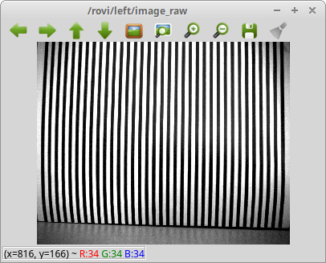

# 合焦度評価ツール

## 治具の準備

視野横幅いっぱいに縦縞を印刷したピント合わせパタンを用意します。<a href="stripe.pdf" >パタンサンプル</a>
  

横幅範囲の縞の数は30〜35程度とします。

## 起動

RoVIの起動後、以下を起動します。
~~~
roscd rovi_qc/fft
roslaunch fft.launch
~~~

## 計測

コンソールに高周波域のスペクトル強度が表示されるの、この数値を見ながらピント調整を行います。最大となったところが最も焦点が合っている位置です。  
ただし最大値は絶対値ではなく、対象となっているシーンに対する値です。シーンが変わると最大値も変化します。